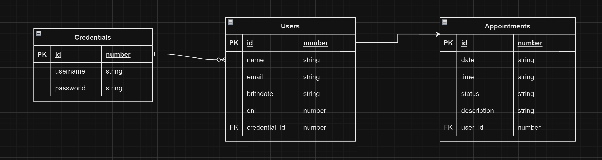

# HOMEWORK

- Usuario invitado
- Usuario registrado
- Los horarios deben ser agendados en horarios de atencion del establecimiento
- Stock ilimitado
- Los turnos reservados pueden ser cancelado (Solo hasta el dia anterior a la reserva)
- Días laborales de lunes a viernes, de 9hs a 18hs

- Envío de confirmación al email del usuario luego de reservar un turno o cancelarlo (NODEMAILER)
- Envío de email luego que el usuario se registre a la página
- El usuario pueda subir una foto perfil a su cuenta por medio de un archivo ímagen (.jpg, .png, etc) (CLOUDINARY)

## Funciones que debe tener la página

- Como usuario invitado quiero poder:
  . Visualizar la página y navegar sobre ella
  . Registrarme a la plataforma creando una nueva cuenta

- Como usuario registrado quiero poder:
  . Loguearme y desloguearme de mi perfil
  . Visualizar mis turnos
  . Agendar un turno seleccionando fecha y hora
  . Cancelar un turno
  . Ver mi historial de turnos
  . Modificar mis datos
  . Que pida confirmación antes de cancelar el turno
  . Pedir confirmación antes de registrarte
  . No poder sacar turno días antes, solo después del día en adelante
  . No poder dar más de un misto turno el mismo día y hora

# UX/UI

- Lading de bienvenida
- Home con información
- Barra de navegación
- Formulario para registro, login
- Formulario para crear turno
- Formulario amigable
  . Que muestre errores en tiempo real
  . Que no se reinicie el formulario
  . Que habilite el boton una vez completado el formulario
  . Que tenga sus placeholder para guiar al usuario
  . Que filtre las fechas invalidas o que no se puedan elegir.

# Diagrama Entidad/Relación

